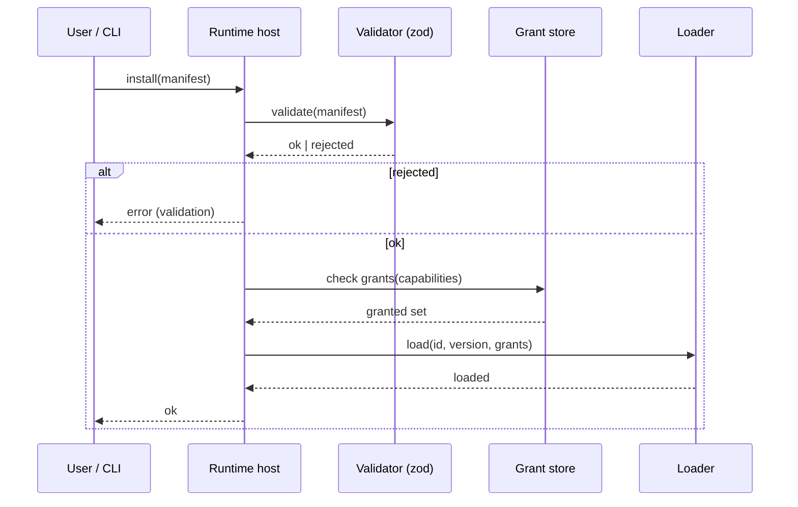
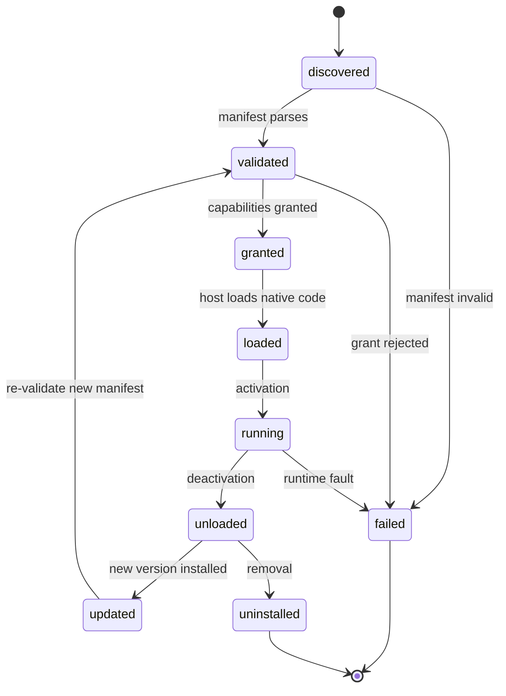

# Creating a Plugin

## Purpose

A Plugin is a Rust-hosted, capability-gated extension to the Workspace Runtime,
declared by a manifest, validated by the host, and executed in native code. A
Plugin extends the Runtime's command and event surface with exactly the
capabilities granted to it — never more, and never inside the privileged
webview. This guide walks one Plugin through the complete authoring lifecycle:
scaffold, manifest, capability declaration, command and event implementation,
build, install, boundary verification, and unload.

The contracts are authoritative; this guide references them rather than
redefining them. Manifest fields, lifecycle states, and the capability model:
[`PluginAPI.md`](../30-specs/PluginAPI.md). The security boundary and CSP
baseline: [`0005-plugin-boundary.md`](../50-adr/0005-plugin-boundary.md).
Typed IPC and the error envelope: [`0002-typed-ipc-contract.md`](../50-adr/0002-typed-ipc-contract.md).
Command surface: [`CLI.md`](../30-specs/CLI.md) and
[`../70-api/CLI.md`](../70-api/CLI.md).

## Capability gates

The Plugin platform is **planned, not shipped**. Phase 0 is the current phase
(M0.4 open) and fixed the boundary (ADR-0005) but ships no Plugin SDK. Per the
roadmap, the Plugin platform lands in Phase 8: **M8.1** SDK (commands, widgets,
services), **M8.2** API (permissions, versioning, lifecycle), **M8.3**
Marketplace (browse, install, update, remove), **M8.4** Sandboxing (permission
system). The `dex plugin` command domain arrives with M8.1. Until a milestone
lands, the manifest and SDK surface below are the intended contract, and the
same commands are driven by the graphical shell when they ship (CLI First,
principle 3), so the steps transfer unchanged.

## Prerequisites

- DEX built and running. Verification order: `bun run check`, `cargo check`
  in `src-tauri/`, then `bun run tauri dev` on a Wayland/Hyprland session.
- A Rust toolchain (`cargo`) able to build `src-tauri/`.
- The `dex` CLI on `PATH` (after M8.1; see Capability gates).
- A directory that will become the Plugin source root; the manifest lives there
  as a file.

## Step 1 — Scaffold the Plugin

**Why.** A Plugin is a native extension of `src-tauri/`, not web code in the
privileged webview (ADR-0005). Scaffolding a Rust crate keeps the Plugin
Rust-hosted by construction: it compiles against the same typed surface the
core uses, and it can never be loaded as renderer code.

1. Create a Rust crate for the Plugin. The crate is a library that the host
   loads; it declares its surface in the manifest and its handlers in Rust.

```bash
cargo new --lib dex-plugin-gitflow
```

2. Add the Plugin SDK as a dependency. The SDK is the typed surface a Plugin
   author compiles against (manifest types, command registration, event
   helpers, service hooks, capability access) — see
   [`PluginAPI.md`](../30-specs/PluginAPI.md).

Expected: a compilable library crate whose only external surface is the
manifest-declared commands and events. The crate has no entry point of its own;
the host drives its lifecycle.

## Step 2 — Author the Plugin manifest

**Why.** The manifest is the single source of truth for what a Plugin declares
and what it may do. It is schema-validated (zod) at install and update; unknown
fields are rejected, never silently ignored (ADR-0005). Authoring the manifest
first forces the capability decision before any code exists.

1. Create `dex.plugin.yaml` at the Plugin root. A complete minimal manifest:

```yaml
id: dev.example.gitflow
name: Git Flow
version: 1.2.0
author: Example
capabilities:
  - dex.commands.run
  - dex.secrets.read:dev.example.gitflow
commands:
  - name: gitflow.start
    args: { branch: string }
    result: { ok: boolean }
events:
  - name: dex.gitflow.merged
    schema: { branch: string }
services:
  - name: gitflow.daemon
```

2. Check the declared fields against the schema
   ([`PluginAPI.md`](../30-specs/PluginAPI.md)): `id` is a reverse-DNS
   identifier, globally unique and immutable; `name` is the display name;
   `version` is semantic; `author` is the author identity; `capabilities` is
   the exact grant set the Plugin declares. `commands`, `events`, and
   `services` are optional. The `id` is immutable once published — a renamed
   Plugin is a new Plugin.

Expected: the file exists with exactly these top-level fields. The Runtime
accepts only fields it knows — unknown fields are rejected, never ignored.

## Step 3 — Declare capabilities (exact grants)

**Why.** Capabilities are exact grants. There is no default elevation: a Plugin
has no capability it did not declare and that was not granted. The grant set is
the intersection of what the manifest declares and what the host grants; a
declared-but-ungranted capability is refused at the boundary, never silently
ignored. This is the security boundary of the extension ecosystem (ADR-0005).

1. List in the manifest exactly the capabilities the Plugin requires. A
   capability is a string naming a permission; capabilities that carry a scope
   use the `:` separator (for example `dex.secrets.read:<plugin-id>`).

2. Add the per-Plugin grant in `src-tauri/capabilities/*.json`. The grant names
   the Plugin `identifier` and the granted capabilities:

```json
{
  "identifier": "dev.example.gitflow",
  "capabilities": ["dex.commands.run", "dex.secrets.read:dev.example.gitflow"]
}
```

3. Grant the minimum set. A Plugin that declares `dex.secrets.read` must also
   be granted it; a Plugin that declares a capability the host does not grant
   is refused at the boundary. Do not grant capabilities the Plugin does not
   declare — the grant set is the intersection, and an undeclared grant is
   inert.

Expected: the manifest and the grant file agree on the capability set. The
Plugin receives exactly the permissions it declares and that are granted — no
default elevation.

## Step 4 — Implement commands on the typed surface

**Why.** A Plugin's commands are typed and zod-validated at the boundary,
exactly as the core IPC surface is (ADR-0002). A Plugin command is invoked
through the same typed plumbing as a core command; its result is validated
against the declared result schema. A Plugin command may not shadow a core
command name, and command names are namespaced by the Plugin `id` to prevent
collision.

1. Implement each declared command as a `#[tauri::command]` handler. Commands
   take exactly one serde struct argument — no `#[serde(rename_all = ...)]`;
   serde defaults (snake_case) are the wire authority — and return
   `Result<T, AppError>`:

```rust
use serde::{Deserialize, Serialize};

use crate::utils::errors::AppError;

#[derive(Debug, Deserialize)]
pub struct GitflowStartArgs {
    pub branch: String,
}

#[derive(Debug, Serialize)]
pub struct GitflowStartOutput {
    pub ok: bool,
}

#[tauri::command]
pub fn gitflow_start(args: GitflowStartArgs) -> Result<GitflowStartOutput, AppError> {
    // The command runs with exactly the capabilities granted to the Plugin.
    Ok(GitflowStartOutput { ok: true })
}
```

2. Register the handler in the single `generate_handler![...]` in
   `src-tauri/src/lib.rs`. Exactly one `invoke_handler` call may exist; a
   second call silently shadows the first (ADR-0002).

3. On the frontend, add a `defineCommand(...)` contract plus zod schemas to
   `src/lib/core/api/commands.ts` (duplicate names are rejected) and expose a
   typed async function in `src/lib/core/services/<domain>.ts`. The command
   name must agree across the Rust handler, the contract, and the grant.

Expected: the command is callable through the typed plumbing, its result is
validated against the declared result schema, and a mismatch fails the zod
parse at the boundary with a message naming the command and the offending
field.

## Step 5 — Emit and subscribe to events

**Why.** A Plugin event is emitted through the Runtime event bus and validated
against its declared schema; invalid payloads are logged and dropped, never
thrown (ADR-0002). Event names are `dex.<domain>.<event>` and must be declared
in the `EVENTS` registry in `src/lib/core/api/events.ts`; only
`src-tauri/src/events/` emits.

1. Declare each event name in the `EVENTS` registry. For the manifest's
   `dex.gitflow.merged`, the name follows the `dex.<domain>.<event>` form and
   the payload schema matches the manifest's `schema: { branch: string }`.

2. Emit the event from the Rust side through the Runtime event bus. The payload
   is validated against the declared schema at the boundary; an invalid payload
   is logged and dropped, never delivered.

Expected: subscribers receive only schema-valid payloads. A malformed payload
is dropped with a log entry, not thrown into the handler.

## Step 6 — Build

**Why.** The Plugin is native code; building it is a compile-time check that the
surface is consistent. The SDK is a compile-time contract: a Plugin that
references an undeclared capability fails validation before it is loaded.

1. Build the Plugin crate:

```bash
cargo build --release
```

2. Run the verification order: `bun run check` (frontend types), then
   `cargo check` in `src-tauri/` (Rust).

Expected: the crate compiles and the frontend types pass. A reference to a
capability the Plugin did not declare fails at compile time, before the Plugin
is ever loaded.

## Step 7 — Install (validate → grant → load)

**Why.** Installation is the lifecycle entry point: the host validates the
manifest, checks the declared capabilities against the per-Plugin grants, and
only then loads the native code. A Plugin that fails validation never proceeds;
a Plugin whose grant is rejected never loads.



1. Install the Plugin from its manifest:

```
dex plugin install ./dex.plugin.yaml
```

Expected: exit code `0`; the lifecycle moves `discovered → validated → granted
→ loaded → running`. `dex plugin list` reports the Plugin `running`.

2. Confirm the rejection path. Add an unknown top-level field to the manifest
   and re-install.

Expected: exit code `3`; the error envelope is
`{ "ok": false, "error": { "type": "validation", "message": "..." } }` and the
message names the unknown field. This is the documented contract: unknown
fields are rejected, never ignored.

## Step 8 — Verify the capability boundary

**Why.** The capability boundary is the security boundary. A declared-but-
ungranted capability is refused at the boundary, never silently ignored; an
undeclared capability is refused before the Plugin is loaded. Verifying the
boundary is how you confirm the Plugin has exactly the authority it declared.

1. Invoke a command that requires a capability the Plugin did not declare.

Expected: the call is refused with `permission_denied` (exit code `5` from the
CLI). The Plugin has no capability it did not declare and that was not granted.

2. Invoke a command that requires a capability the Plugin declared but the host
   did not grant (remove the grant from `src-tauri/capabilities/*.json` and
   reinstall).

Expected: the Plugin is refused at the boundary — it never loads with a grant
it was not given. There is no default elevation.

3. Confirm the shell's strict CSP still applies. The CSP baseline (ADR-0005)
   constrains the webview regardless of any Plugin; a Plugin cannot relax it.

Expected: the CSP in `tauri.conf.json` is unchanged by the Plugin's presence.

## Step 9 — Unload and uninstall

**Why.** Deactivation removes the Plugin's commands and events from the surface;
removal revokes its grants. Every transition is observable and recorded in the
journal.



1. Unload the Plugin:

```
dex plugin uninstall dev.example.gitflow
```

Expected: exit code `0`; the lifecycle moves `running → unloaded → uninstalled`;
the Plugin's commands and events are removed from the surface and its grants
are revoked. `dex plugin list` no longer reports it.

2. Confirm the update path. Install a new version of the manifest.

Expected: the lifecycle moves `unloaded → updated → validated → granted →
loaded → running`; the new manifest is re-validated and re-granted before the
Plugin returns to `running`. A failed update leaves the previous version
loaded.

## Common pitfalls

| Pitfall | Cause | Resolution |
|---|---|---|
| Install exits `3`, `error.type` is `validation`, message names a field | A top-level or nested field outside the schema — a typo or version drift | Remove the unknown field and re-install. Unknown fields are rejected by contract. |
| A declared capability is refused with `permission_denied` | The capability is declared in the manifest but not granted in `src-tauri/capabilities/*.json` | Add the grant for the Plugin `identifier`. The grant set is the intersection of declared and granted. |
| A command is not callable | The command name disagrees across the Rust handler, the contract, and the grant | Align the command name in `generate_handler!`, `core/api/commands.ts`, and the grant. |
| A second `invoke_handler` call silently shadows the first | A second `tauri::generate_handler!` was added | Append the handler to the single `generate_handler!` in `src-tauri/src/lib.rs`. |
| A command shadows a core command | The command name collides with the core surface | Namespace the command by the Plugin `id`; a Plugin command may not shadow a core command name. |
| A Plugin references a capability it did not declare | The SDK is a compile-time contract | Declare the capability in the manifest and grant it; an undeclared reference fails validation before load. |
| A Secret read is refused | The Plugin lacks `dex.secrets.read:<plugin-id>` or the Secret is out of scope | Grant the scoped capability and keep the Secret Plugin-scoped; a Plugin never reads the keyring directly. |

Every lifecycle transition is recorded in the Journal
([`Journal.md`](../30-specs/Journal.md)); `dex journal show` reports the prior
and new state for any failure, including refused grants and aborted installs.

## Related Documents

- Canonical terminology (Plugin, Widget): [`../00-vision/03_Glossary.md`](../00-vision/03_Glossary.md)
- Plugin First principle: [`../00-vision/02_Principles.md`](../00-vision/02_Principles.md)
- Plugin API contract (manifest, lifecycle, capability model): [`../30-specs/PluginAPI.md`](../30-specs/PluginAPI.md)
- Plugin boundary and CSP baseline: [`../50-adr/0005-plugin-boundary.md`](../50-adr/0005-plugin-boundary.md)
- Typed IPC contract and error envelope: [`../50-adr/0002-typed-ipc-contract.md`](../50-adr/0002-typed-ipc-contract.md)
- Layer ownership (Rust owns system access): [`../50-adr/0001-layer-ownership.md`](../50-adr/0001-layer-ownership.md)
- Plugin and Widget architecture: [`../20-architecture/27_Plugins.md`](../20-architecture/27_Plugins.md)
- Security architecture and threat model: [`../20-architecture/29_Security.md`](../20-architecture/29_Security.md)
- Secrets contract (Plugin-scoped Secrets): [`../30-specs/Secrets.md`](../30-specs/Secrets.md)
- Roadmap and milestone gates (Phase 8): [`../10-product/11_Product_Roadmap.md`](../10-product/11_Product_Roadmap.md)
- CLI contract: [`../30-specs/CLI.md`](../30-specs/CLI.md)
- CLI reference: [`../70-api/CLI.md`](../70-api/CLI.md)
- Plugin and Widget SDK surface: [`../70-api/PluginsWidgets.md`](../70-api/PluginsWidgets.md)
- Sibling guides: [`CreatingWidget.md`](CreatingWidget.md), [`CreatingWorkspace.md`](CreatingWorkspace.md), [`CreatingTheme.md`](CreatingTheme.md)