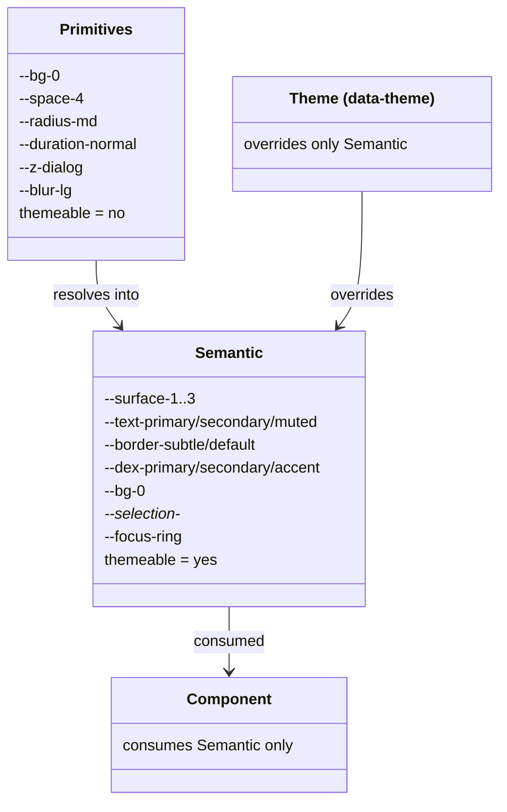
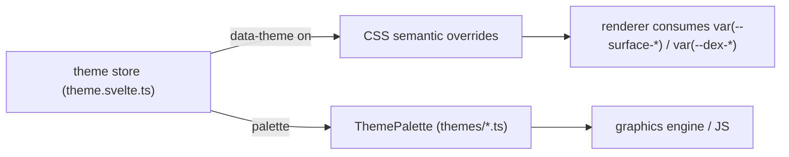

# Creating and Applying a Theme

## Purpose

Theming is the contract by which users and authors restyle DEX without touching
the core. A theme is a semantic-layer override: it changes the role tokens that
components consume, and nothing else. This guide walks one theme through the
complete lifecycle — understand the layer rule, author the theme manifest,
validate it, apply it, keep the programmatic palette in sync, and verify it
against the transparency and motion contracts.

The contract is authoritative; this guide references it rather than redefining
it. The themeable token set, the manifest format, and the validation rules:
[`../30-specs/Theme.md`](../30-specs/Theme.md). Token values and motion:
[`../40-engineering/DesignSystem.md`](../40-engineering/DesignSystem.md).
Command surface: [`../30-specs/CLI.md`](../30-specs/CLI.md) and
[`../70-api/CLI.md`](../70-api/CLI.md).

## Capability gates

The theme store and the three built-in themes — **dark** (the default),
**light**, and **cyber** — are live in Phase 0 (M0.2 Design System and M0.3
Core Infrastructure are done). What ships later is the authoring surface: the
`dex theme` command domain, the manifest validator, and theme installation
arrive with the Phase 1 theming milestone (**M1.4**), which closes live
switching end to end. Until that milestone lands, the built-in themes are the
delivered set, and the manifest format below is the intended contract —
already specified and validated against the Theme specification, so the steps
transfer unchanged when the CLI ships (CLI First, principle 3).

## Why themes are semantic-layer overrides

Components consume semantic tokens only (`var(--surface-1)`,
`var(--text-primary)`, `var(--dex-primary)`, …) — never primitive ramps and
never hardcoded values (ADR-0003). Because components are theme-agnostic,
restyling DEX is a matter of editing the semantic layer. A theme therefore
overrides *only* the semantic layer; primitives (color ramps, spacing, radii,
durations, z-index, blur) are shared across themes and are not themeable.



The layer rule: components consume semantic tokens for every color and
typography decision. The scale tokens (spacing, radii, duration, z-index, blur)
are stable by design and may be consumed directly. Never hardcode a hex or
`rgba` value in a component — that is a code-review failure, not a theme
override.

## Step 1 — Understand the themeable token set

**Why.** A theme is not a free-form stylesheet. It may override exactly the
tokens the Theme specification lists; anything else is rejected, never
silently ignored. Knowing the set up front makes a valid manifest the first
try.

The themeable set (see [`../30-specs/Theme.md`](../30-specs/Theme.md)):

- Surfaces: `--surface-0`, `--surface-1`, `--surface-2`, `--surface-3`,
  `--surface-4`
- Text: `--text-primary`, `--text-secondary`, `--text-muted`,
  `--text-disabled`
- Brand: `--dex-primary`, `--dex-secondary`, `--dex-accent`,
  `--dex-success`, `--dex-warning`, `--dex-danger`, `--on-primary`
- Borders: `--border-subtle`, `--border-default`, `--border-strong`
- Glass: `--glass-light`, `--glass-medium`, `--glass-heavy`,
  `--glass-ultra`, `--glass-border-light`, `--glass-border`,
  `--glass-border-strong`
- HUD / sidebar / dock: `--hud-bg`, `--hud-border`, `--hud-highlight`,
  `--sidebar-bg`, `--sidebar-hover`, `--sidebar-active`, `--dock-bg`,
  `--dock-border`
- Backdrop: `--bg-0`, `--bg-1`, `--bg-2`, `--bg-3`, `--bg-4`
- Shadows: `--shadow-xs`, `--shadow-sm`, `--shadow-md`, `--shadow-lg`,
  `--shadow-xl`, `--shadow-glow`, `--shadow-accent`
- Focus and selection: `--focus-ring`, `--selection-bg`, `--selection-text`
- Scrollbars: `--scrollbar-thumb`, `--scrollbar-thumb-hover`

A theme may omit tokens it does not override; omitted tokens inherit from the
default theme. A theme may **not** override a primitive token — an attempt is a
`validation` error.

## Step 2 — Author the theme manifest

**Why.** A theme is a declaration, not a patch. The manifest is diffable,
reviewable, and scriptable — the same artifact validates, installs, and
reproduces the theme anywhere. Authoring by hand is the canonical path.

1. Create a theme manifest — a YAML file named after the theme:

```yaml
# solar.yaml — theme manifest
name: solar
version: 1.0.0
overrides:
  --surface-1: rgba(40, 44, 30, 0.35)
  --surface-2: rgba(40, 44, 30, 0.6)
  --text-primary: "#f4f1de"
  --dex-accent: "#e07a5f"
  --bg-0: "#1a1d14"
```

2. Check the declaration against the schema:

| Field | Type | Required | Meaning |
|---|---|---|---|
| `name` | string | yes | Theme identifier; must match the `data-theme` value |
| `version` | string | yes | Semantic version of the theme |
| `overrides` | object | yes | Semantic-layer token overrides, keyed by token name |

Rules that bind here:

- Every `overrides` key must be in the themeable set from Step 1.
- Every value must be a valid CSS color.
- A `name` that collides with a built-in theme (`dark`, `light`, `cyber`) is
  rejected unless it is an explicit redefinition with a bumped version.

Expected: the file exists with exactly these fields. The Runtime accepts only
fields it knows — unknown fields are rejected, never ignored.

## Step 3 — Validate the manifest

**Why.** Validation runs before acceptance, at authoring and at install time.
A manifest that fails validation is rejected with an `AppError` of type
`validation`; the Runtime never partially applies a theme. Validating before
installing turns a typo into a typed error instead of a half-themed shell.

1. Run `dex theme validate ./solar.yaml`.

Expected: exit code `0`; with `--json`, stdout is
`{ "ok": true, "data": { } }`.

2. Confirm the rejection path. Add overrides for primitive tokens:

```yaml
  --dex-cyan-500: "#22d3ee"
  --dex-gray-950: "#0a0a0a"
```

3. Re-run `dex theme validate ./solar.yaml`.

Expected: exit code `3`; the error envelope is
`{ "ok": false, "error": { "type": "validation", "message": "..." } }` and the
message names the unknown token. This is the documented contract: overrides
outside the themeable set are rejected, never silently ignored.

4. Remove the primitive override, then break a value — for example set
   `--dex-accent: banana`.

Expected: exit code `3`; `validation`; the message names the invalid color.
Restore a valid color before continuing.

## Step 4 — Apply the theme

**Why.** Installation is a declaration of intent; applying is a runtime act.
The theme store owns the switch: it sets `data-theme` on `<html>`, persists
the choice via `core/utils/storage.ts`, and exposes the current `ThemePalette`
for JS and the graphics engine. `initTheme()` runs at boot so the attribute is
set before first paint.

1. Run `dex theme set solar`.

Expected: exit code `0`; the shell re-themes live. The attribute on `<html>`
is now `data-theme="solar"`, CSS applies the semantic overrides, and every
component that consumes `var(--surface-*)` / `var(--dex-*)` picks up the change
— no component was re-rendered with new values, because components never
hardcode colors.

2. Confirm the installed set: `dex theme list`.

Expected: the manifest themes are listed alongside the built-ins; `solar`
appears with the version from the manifest.

3. Confirm idempotency: `dex theme set solar` again.

Expected: exit code `0`. Setting the theme that is already active is
idempotent and succeeds without error (CLI scripting contract).



The choice survives restart: the store persists it, and `initTheme()` restores
it before the first paint of the next boot.

## Step 5 — Keep the ThemePalette mirror in sync

**Why.** CSS custom properties are unreadable to code paths that do not run
through CSS — WebGL uniforms and canvas fills read a typed record instead.
`src/lib/ui/themes/types.ts` defines `ThemePalette`; each theme exports one
const. The mirror is what the graphics engine consumes, so a theme that ships
without its palette is a theme the GPU half of the shell cannot render.

**Sync rule (ADR-0003):** when a semantic value changes in `tokens.css`,
update the matching palette file in `themes/`. The comment block at the top of
`themes/types.ts` states this rule. `ThemePalette` carries only what JS/GPU
need; role tokens that stay in CSS (`--surface-4`, `--text-muted`, `--glass-*`,
`--focus-ring`, `--selection-*`) are not mirrored. The CSS is authoritative for
the UI; the TS mirror is authoritative for programmatic use.

For the `solar` theme, add `src/lib/ui/themes/solar.ts` exporting a
`ThemePalette` whose values match the manifest's resolved colors. The palette
`name` must equal the manifest `name`.

## Step 6 — Verify against the transparency and motion contracts

**Why.** A theme that looks right in a browser tab can still break the shell —
by painting an opaque backdrop, or by animating a property that drops frames.
The transparent compositing contract (ADR-0004) and the motion contract
(ADR-0003) survive theme changes and must be re-verified on the desktop.

1. **Run on the desktop, not the tab.** `bun run tauri:dev` on a
   Wayland/Hyprland session. Transparent-window behavior cannot be checked in
   a browser tab (ADR-0004).

2. **Surfaces stay glass.** Surfaces are translucent
   (`--surface-*` over the desktop) — the backdrop comes from
   `backdrop-filter` on glass panels, never from an opaque body/window paint.
   An opaque `--bg-0` in a theme is not a validation error, but it
   is a design failure: it hides the desktop and breaks the shell's identity.
   Keep translucent surfaces and a dark-appropriate backdrop.

3. **Motion is unchanged.** Motion durations are token-driven —
   `--duration-fast` (120 ms) for hover and small state changes,
   `--duration-normal` (220 ms) as the standard, `--duration-slow` (360 ms)
   for bigger reveals — with the single easing `var(--ease-standard)`
   (`cubic-bezier(0.2, 0.8, 0.2, 1)`), and only `transform`/`opacity` animate
   — never width, height, top, left, margin, or `background-color`. A theme
   does not change durations, easing, or z-index; those are primitives and
   are not themeable. `prefers-reduced-motion` keeps disabling non-essential
   motion.

4. **No per-frame blur.** `backdrop-filter` is a compositor cost on every
   repaint; blur radii stay within the token scale and panels never
   re-blur-every-frame (ADR-0004).

## Troubleshooting

| Symptom | Cause | Resolution |
|---|---|---|
| `dex theme validate` exits `3`, message names a token | An override key is outside the themeable set — typically a primitive (`--dex-*` ramp, spacing, duration) | Remove the token; a theme may override only the semantic-layer tokens in Step 1. |
| `dex theme validate` exits `3`, message names a value | The override value is not a valid CSS color | Use a valid hex, `rgb()`/`rgba()`, or named color; re-validate. |
| `dex theme set` rejects the theme name | The `name` collides with a built-in theme (`dark`, `light`, `cyber`) without an explicit redefinition | Rename the theme, or declare it as a redefinition with a bumped `version`. |
| The theme applies in the browser tab but the desktop looks wrong | Transparent-compositing behavior differs outside Tauri | Re-verify on `bun run tauri:dev`; check that surfaces are translucent and no opaque layer paints the window (ADR-0004). |
| The GPU visuals do not pick up the theme | The `ThemePalette` mirror is missing or stale | Add `themes/solar.ts` per Step 5; the CSS is not readable from WebGL/canvas code. |
| Theme does not survive restart | The choice was not persisted | The store persists via `core/utils/storage.ts`; confirm the store wrote before shutdown and that `initTheme()` runs at boot. |

## Related Documents

- Canonical terminology (Theme): [`../00-vision/03_Glossary.md`](../00-vision/03_Glossary.md)
- Native First, Context over Applications principles:
  [`../00-vision/02_Principles.md`](../00-vision/02_Principles.md)
- Theme contract: [`../30-specs/Theme.md`](../30-specs/Theme.md)
- Design token architecture decision: [`../50-adr/0003-design-tokens.md`](../50-adr/0003-design-tokens.md)
- Transparent compositing contract: [`../50-adr/0004-transparent-compositing.md`](../50-adr/0004-transparent-compositing.md)
- Token reference and values: [`../40-engineering/DesignSystem.md`](../40-engineering/DesignSystem.md)
- Performance standards (motion contract): [`../40-engineering/Performance.md`](../40-engineering/Performance.md)
- Token source of truth: `src/lib/ui/styles/tokens.css`
- Theme store: `src/lib/core/stores/theme.svelte.ts`
- CLI contract: [`../30-specs/CLI.md`](../30-specs/CLI.md)
- CLI reference: [`../70-api/CLI.md`](../70-api/CLI.md)
- Sibling guides: [`CreatingWorkspace.md`](CreatingWorkspace.md), [`UsingAI.md`](UsingAI.md), [`CreatingPlugin.md`](CreatingPlugin.md), [`CreatingWidget.md`](CreatingWidget.md)
