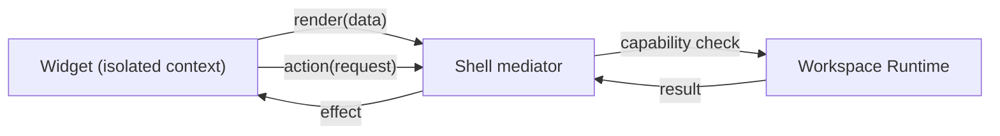
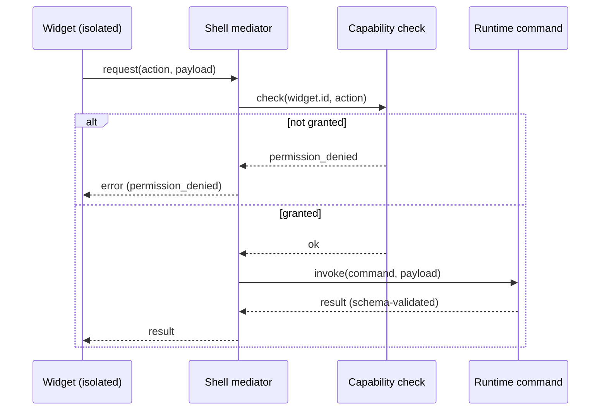
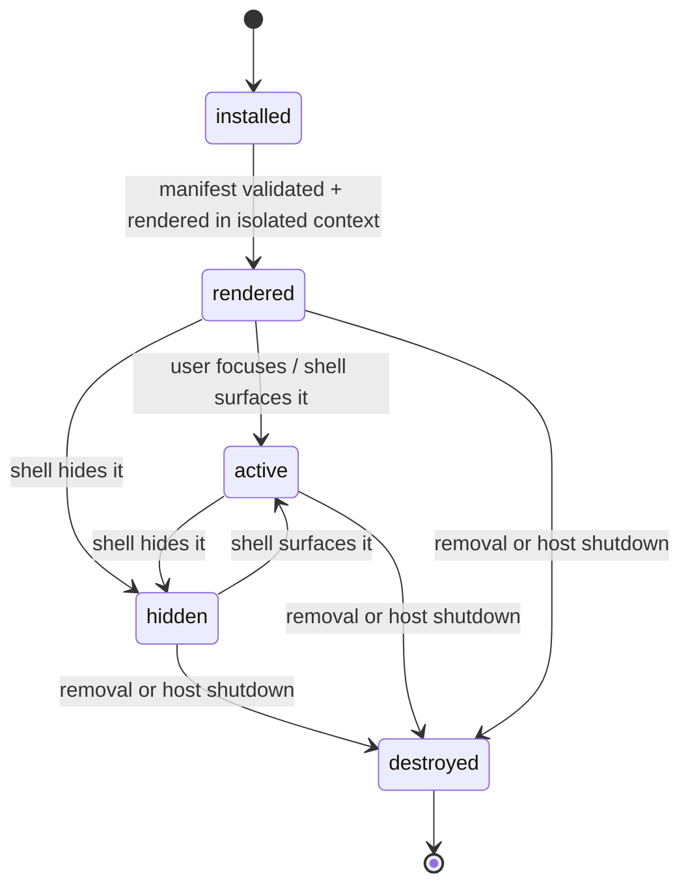

# Creating a Widget

## Purpose

A Widget is a sandboxed UI extension, rendered in an isolated context with no
IPC access of its own. A Widget's every effect is mediated by the Workspace
Runtime through shell-mediated commands; a Widget never imports
`@tauri-apps/api`. This guide walks one Widget through the complete authoring
lifecycle: scaffold, manifest, sandboxed render, mediated effects, Workspace
attachment, and testing.

The contracts are authoritative; this guide references them rather than
redefining them. Manifest fields, SDK surface, isolation model, and the
mediation protocol: [`WidgetAPI.md`](../30-specs/WidgetAPI.md). The security
boundary and CSP baseline: [`0005-plugin-boundary.md`](../50-adr/0005-plugin-boundary.md).
Command surface: [`CLI.md`](../30-specs/CLI.md) and
[`../70-api/CLI.md`](../70-api/CLI.md).

## Capability gates

The Widget platform is **planned, not shipped**. Phase 0 is the current phase
(M0.4 open) and fixed the boundary (ADR-0005) but ships no Widget SDK. Per the
roadmap, the Widget platform lands in Phase 3: **M3.1** Widget SDK (registry,
metadata, lifecycle), **M3.2** Layout Engine (drag, resize, snap, dock, float),
**M3.3** Persistence (SQLite-backed positions/sizes/settings), **M3.4** Widget
Marketplace API (discovery, install, update). The `dex widget` command domain
arrives with M3.1. Until a milestone lands, the manifest and SDK surface below
are the intended contract, and the same commands are driven by the graphical
shell when they ship (CLI First, principle 3), so the steps transfer unchanged.

## Prerequisites

- DEX built and running. Verification order: `bun run check`, `cargo check`
  in `src-tauri/`, then `bun run tauri dev` on a Wayland/Hyprland session.
- The `dex` CLI on `PATH` (after M3.1; see Capability gates).
- A directory that will become the Widget root; the manifest and the entry
  document live there.

## Step 1 — Scaffold the Widget

**Why.** A Widget is a bundle, not a host extension: an entry document plus a
manifest, rendered in an isolated context the Runtime provides. Scaffolding the
bundle with no Tauri dependency keeps the Widget effect-free by construction —
there is no `@tauri-apps/api` in the bundle to import.

1. Create the Widget root with an entry document and the manifest:

```bash
mkdir dex-widget-ci-badge
touch index.html
touch dex.widget.yaml
```

2. The entry document is the isolated-context entry (`entry` in the manifest).
   It loads the Widget SDK bundle and nothing else.

Expected: a self-contained bundle with exactly two declared files — the entry
document and the manifest. A Widget that declares a capability it will not use
is a review failure.

## Step 2 — Author the Widget manifest

**Why.** The manifest is schema-validated at install and update; unknown fields
are rejected. It is the single source of truth for what the Widget may do, and
the host reads the declared capabilities from it before any render. Authoring
the manifest first forces the capability decision before any UI code exists.

1. Create `dex.widget.yaml`. A complete minimal manifest:

```yaml
id: dev.example.ci-badge
name: CI Badge
version: 0.4.1
entry: index.html
capabilities:
  - dex.commands.run:dex.gitflow.status
lifecycle:
  refresh: 60s
settings:
  schema: { repo: string }
```

2. Check the declared fields against the schema
   ([`WidgetAPI.md`](../30-specs/WidgetAPI.md)): `id` is a reverse-DNS
   identifier, globally unique and immutable; `name` is the display name;
   `version` is semantic; `entry` is the isolated-context entry document;
   `capabilities` is the exact grant set. `lifecycle` (render-time behavior such
   as the `refresh` interval) and `settings` (the declared settings schema,
   validated on write) are optional.

3. Decide the capability set. A Widget that declares no capabilities renders but
   may perform no effects: every action it requests is refused with
   `permission_denied`. Declare exactly the mediated actions the Widget will
   request.

Expected: the file exists with exactly these top-level fields. The Runtime
accepts only fields it knows — unknown fields are rejected, never ignored.

## Step 3 — Render in the sandboxed context

**Why.** A Widget renders in an isolated context: a sandboxed frame with its
own origin, distinct from the shell's privileged webview. The Widget's visual
output is composited into the shell by the Runtime; the Widget never paints
outside the bounds the shell gives it. Rendering alone grants no capability.



1. Use the Widget SDK to receive data and drive the UI. The SDK surface is
   deliberately small and effect-free by construction
   ([`WidgetAPI.md`](../30-specs/WidgetAPI.md)):

   - **render** — receives the data payload the Runtime grants to the Widget.
   - **state** — a local state container; state is per-Widget and is not
     persisted unless the Widget declares a settings schema and writes through
     the mediated settings action.
   - **lifecycle hooks** — `onMount`, `onRefresh`, `onDestroy`, called by the
     Runtime at the corresponding lifecycle transitions.
   - **mediated action calls** — `request(action, payload)`; every action goes
     to the shell mediator, never to IPC.

2. The SDK does not export `invoke`, `listen`, or any other Tauri API. There is
   no path from a Widget to the Runtime other than `request`. A Widget that
   imports `@tauri-apps/api` fails validation and is not rendered.

Expected: the Widget renders its data payload in the isolated context. It has no
channel to the Runtime other than `request`, and it paints only inside the
bounds the shell gives it.

## Step 4 — Mediate every effect through a shell command

**Why.** Every effect a Widget requests is mediated: the Widget asks, the shell
checks capability, the Runtime performs, the result returns. The Widget never
performs the effect itself. A Widget that imported `@tauri-apps/api` directly
would reach the filesystem through the same typed surface as the shell itself
(ADR-0005); `request` is the only door, and it is capability-gated.



1. Request every effect — a command, a state write, a navigation, a launch —
   through `request(action, payload)`.

2. Never import `@tauri-apps/api`. Never call `invoke`, `listen`, or a filesystem
   or shell API. The mediation protocol is the same typed IPC machinery the
   shell itself uses (ADR-0002): the action's payload and result are
   zod-validated at the boundary, invalid payloads are logged and dropped, and
   the error envelope is the closed set from ADR-0002.

Expected: an effect the Widget is granted succeeds and returns a schema-validated
result. An effect the Widget is not granted returns the `permission_denied`
error envelope; the Widget cannot perform it itself.

## Step 5 — Add the Widget to a Workspace

**Why.** A Widget is part of a Workspace's Context, not a standalone window.
Installing it declares the bundle; enabling it surfaces it in the Workspace
under the Runtime's lifecycle control. The Widget lifecycle is: `installed →
rendered → active → hidden → destroyed` — visibility is a shell decision, and a
Widget may be `active` without being visible.



1. Install the Widget from its manifest:

```
dex widget install ./dex.widget.yaml
```

Expected: exit code `0`; the manifest is validated and the Widget enters
`installed`, then `rendered` in its isolated context.

2. Enable it in the active Workspace:

```
dex widget enable dev.example.ci-badge
```

Expected: exit code `0`; the Widget moves to `active`. The Runtime surfaces it,
and the shell mediates every action it requests. A hidden Widget receives
refresh cadence at the declared `lifecycle.refresh` interval or is paused per
the declared lifecycle policy.

3. Disable it:

```
dex widget disable dev.example.ci-badge
```

Expected: exit code `0`; the Widget moves to `hidden`. Disabling is not removal —
the Widget's state persists until removal or host shutdown.

## Step 6 — Test the mediation boundary

**Why.** A Widget's security contract is negative: it must never reach the
Runtime except through `request`. Testing the boundary proves the Widget is
effect-free by construction and grants exactly what it declares.

1. Attempt a direct effect from the Widget bundle — an `@tauri-apps/api` import
   or a call to a non-mediated API.

Expected: validation at install rejects the bundle and the Widget is not
rendered.

2. Request an action the Widget is not granted.

Expected: the shell mediator returns the `permission_denied` error envelope. The
Widget has no capability it did not declare and that was not granted — no
default elevation.

3. Request an action with a malformed payload.

Expected: the payload is logged and dropped at the boundary; the Widget receives
no result and no exception is thrown into the handler.

4. Exercise the lifecycle hooks: mount, refresh, destroy.

Expected: `onMount`, `onRefresh`, and `onDestroy` fire at the corresponding
transitions; state is discarded at `destroyed`.

## Security checklist

The Widget contract has six hard rules
([`WidgetAPI.md`](../30-specs/WidgetAPI.md)). Review the Widget against all of
them before install:

1. **No direct IPC.** The Widget never imports `@tauri-apps/api` and never
   reaches the Runtime except through `request`.
2. **Isolated context.** The Widget renders in a sandboxed frame with its own
   origin; it never shares the shell webview's origin or privileges.
3. **Exact grants.** The Widget receives exactly the capabilities it declares
   and that are granted — no default elevation.
4. **No filesystem, no shell, no SQLite.** The Widget cannot reach the
   filesystem, execute shell commands, or touch SQLite; only the Runtime can,
   through mediated actions.
5. **Strict CSP applies.** The shell's CSP baseline (ADR-0005) constrains the
   Widget context; the Widget cannot relax it.
6. **Validation at install.** Manifests and entry documents are validated at
   install and update; unknown fields and forbidden imports are rejected.

## Common pitfalls

| Pitfall | Cause | Resolution |
|---|---|---|
| Install rejects the bundle | The entry document imports `@tauri-apps/api` | Remove the import; every effect goes through `request(action, payload)`. |
| Every effect is refused with `permission_denied` | The action is not in the Widget's granted capability set | Declare and grant exactly the capabilities the Widget needs; a Widget that declares none may render but performs no effects. |
| State is lost between sessions | State is per-Widget and not persisted by default | Declare a `settings` schema and write through the mediated settings action; positions and sizes persist via SQLite (M3.3). |
| A Widget paints outside its bounds | The Widget ignores the compositing boundary | Render only inside the bounds the shell gives the Widget; the Runtime composites the output. |
| An action returns an unexpected error | The payload or result failed schema validation at the boundary | Check the declared action schema; invalid payloads are logged and dropped, never delivered. |
| A hidden Widget keeps running | The lifecycle policy is not declared | Declare `lifecycle.refresh` (and any pause policy); a hidden Widget follows the declared policy. |

## Related Documents

- Canonical terminology (Widget, Plugin): [`../00-vision/03_Glossary.md`](../00-vision/03_Glossary.md)
- Plugin First principle: [`../00-vision/02_Principles.md`](../00-vision/02_Principles.md)
- Widget API contract (manifest, SDK surface, mediation protocol): [`../30-specs/WidgetAPI.md`](../30-specs/WidgetAPI.md)
- Plugin API contract (a Plugin's UI is a Widget): [`../30-specs/PluginAPI.md`](../30-specs/PluginAPI.md)
- Plugin boundary and CSP baseline: [`../50-adr/0005-plugin-boundary.md`](../50-adr/0005-plugin-boundary.md)
- Typed IPC contract and error envelope: [`../50-adr/0002-typed-ipc-contract.md`](../50-adr/0002-typed-ipc-contract.md)
- Layer ownership (frontend never touches filesystem or SQLite): [`../50-adr/0001-layer-ownership.md`](../50-adr/0001-layer-ownership.md)
- Plugin and Widget architecture: [`../20-architecture/27_Plugins.md`](../20-architecture/27_Plugins.md)
- Security architecture and threat model: [`../20-architecture/29_Security.md`](../20-architecture/29_Security.md)
- Workspace Manifest contract (Widgets attach to a Workspace's Context): [`../30-specs/Manifest.md`](../30-specs/Manifest.md)
- Roadmap and milestone gates (Phase 3): [`../10-product/11_Product_Roadmap.md`](../10-product/11_Product_Roadmap.md)
- CLI contract: [`../30-specs/CLI.md`](../30-specs/CLI.md)
- CLI reference: [`../70-api/CLI.md`](../70-api/CLI.md)
- Plugin and Widget SDK surface: [`../70-api/PluginsWidgets.md`](../70-api/PluginsWidgets.md)
- Sibling guides: [`CreatingPlugin.md`](CreatingPlugin.md), [`CreatingWorkspace.md`](CreatingWorkspace.md), [`CreatingTheme.md`](CreatingTheme.md)