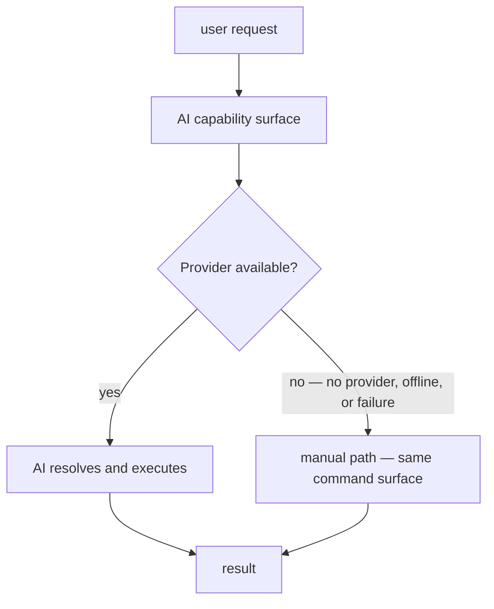

# Using AI Capabilities in DEX

## Purpose

This guide walks the AI capability surface of the Workspace Runtime end to
end: confirm the Runtime is complete with no AI configured, enable a local
model Provider, connect a Memory Provider to the Knowledge Vault, use the
intent surface and AI Widgets, and then disable everything and confirm the
Runtime remains complete. The through-line is principle 12 — **AI is
Optional**: every AI capability degrades gracefully to a fully manual
workflow, and no core capability requires a model, an API key, or a network.

The contracts are authoritative; this guide references them rather than
redefining them. AI architecture and the Provider model:
[`26_AI.md`](../20-architecture/26_AI.md). Knowledge Vault and Memory Provider
contract: [`Knowledge.md`](../30-specs/Knowledge.md). Widget contract:
[`WidgetAPI.md`](../30-specs/WidgetAPI.md). Command surface:
[`CLI.md`](../30-specs/CLI.md).

## Why AI is optional

DEX is not an AI application (Manifesto; Non-Goals). Intelligence is a
feature, not an identity. Two consequences govern everything in this guide:

1. **Local-first.** Offline First (principle 2) applies to AI as to everything
   else: the machine works fully with no network, and anything that leaves the
   machine does so by explicit request. Local models are the default posture.
2. **Never on the critical path.** AI capabilities sit behind Providers and
   are never on the critical path of the Workspace Runtime. The Knowledge
   Vault works without intelligence; intelligence is a *consumer* of the
   Vault, never a precondition.

The fallback to the manual path is not an error path; it is the primary path.
AI is a shortcut over a fully functional manual surface, and the manual
surface is always present.

## Capability gates

The AI subsystem ships in Phase 6 (roadmap M6.1–M6.5). Until those milestones
land, everything past Step 1 in this guide is the intended surface: the
commands and settings it describes are what the milestones deliver, and the
manual path is the entire product. AI configuration is hosted in the Settings
surface (**M5.6 Settings** — theme, plugins, AI, system).

| Milestone | Deliverable |
|---|---|
| M6.1 | LLM Provider: Ollama, OpenAI, Anthropic |
| M6.2 | Memory: conversations, desktop state, context |
| M6.3 | Intent Engine: intent → command → Rust → Hyprland |
| M6.4 | AI Widgets: chat, search, assistant |
| M6.5 | Voice: STT, TTS, wake word |

## Prerequisites

- DEX built and running. Verification order: `bun run check`, `cargo check` in
  `src-tauri/`, then `bun run tauri dev` on a Wayland/Hyprland session.
- For Step 2: the local model runtime of the chosen Provider (Ollama here)
  installed and a model pulled.
- For Step 3: a Memory Provider backend (a local database or an embedding
  store) available on the machine.
- A declared Workspace to operate on; authoring and activating one is covered
  by the sibling guide [`CreatingWorkspace.md`](CreatingWorkspace.md).

## Step 1 — Confirm the Runtime is complete without AI

**Why.** Principle 12 states the rule; this step proves it. Before any
Provider is configured — no model, no API key, no network — every core
capability must be reachable through the command surface and the shell. This
is not a diminished mode of DEX; it is DEX.

1. Activate a Workspace and exercise its lifecycle:
   `dex workspace activate` (declaration and activation are covered in
   [`CreatingWorkspace.md`](CreatingWorkspace.md)).

Expected: the Workspace transitions `declared → activating → active`; sessions
launch, window layout restores, Context is re-established. No AI component is
involved at any point.

2. Write to and read from the Knowledge Vault through the CLI:
   `dex vault add "note: verify vault works without a model"` followed by
   `dex vault search verify`.

Expected: the entry is stored with its provenance (`workspace_id`,
`created_at`) and returned by full-text search. The Vault is a local SQLite
database owned by Rust; it requires no model, no API key, and no network
([`Knowledge.md`](../30-specs/Knowledge.md)).

3. Capture and restore a Workspace Snapshot (see
   [`CreatingWorkspace.md`](CreatingWorkspace.md)).

Expected: the capture and restore complete. Snapshot capture reads the active
Context from the Vault — a plain read of a `context` entry, not an AI
operation.

4. Confirm the privacy posture: with no Provider configured, nothing has left
   the machine. The Vault database lives under the local data directory; there
   is no account, no telemetry, and no background network activity.

Expected: the manual workflow — Workspace lifecycle, Vault, Snapshots — is
complete and self-contained. This is the baseline every later step must leave
untouched.

## Step 2 — Enable a local model Provider (M6.1)

**Why.** AI capabilities are reached through Providers — adapters that
implement a fixed backend interface, so swapping the backend never changes the
capability surface. The model Provider surface ships with three backends:
Ollama (local), OpenAI, and Anthropic. Local is the default posture: a local
model keeps the model weights and every request on the machine (Offline
First, privacy). A remote Provider is an explicit opt-in to egress; nothing
leaves the machine as a matter of course.

1. Choose the Ollama Provider — local, offline-first, no network dependency.

2. Install and run the model runtime, and pull a model, on the machine.

Expected: the model runtime serves a local endpoint; the model is available
with the network cable pulled.

3. Register the Provider through the Settings surface (M5.6) and set it active.

Expected: the AI capability surface reports the Provider available; the core
Workspace Runtime path is unchanged — the Provider sits behind the capability
surface, never on it.

4. Confirm the degradation contract. Stop the local model runtime and issue an
   AI request.

Expected: the Provider reports unavailability and the capability degrades to
the manual path — the same command surface, the same result
([`26_AI.md`](../20-architecture/26_AI.md)). No request hangs waiting for a
model; the fallback is automatic.

Privacy note: with Ollama, the model and all requests stay local. If you later
register the OpenAI or Anthropic Provider, every request is an explicit egress
to a remote model endpoint, and any API key is governed by the Secrets
subsystem ([`Secrets.md`](../30-specs/Secrets.md)) — never stored in the
Knowledge Vault.

## Step 3 — Connect a Memory Provider to the Knowledge Vault

**Why.** AI is a consumer of the Vault, not its owner. The Memory Provider is
the adapter that connects the Vault to a storage or model backend — a local
database, an embedding store, a model endpoint. The interface is fixed; the
Vault core owns query semantics and validation, and a Provider never sees
unvalidated input. The essential property of the interface is that `embed` is
optional: a Provider without an embedding backend returns a structured
`unsupported`, and the Vault core degrades to full-text search.

1. Choose a Memory Provider backend. For the offline-first posture, prefer a
   local database or a local embedding store; both keep vectors and entries on
   the machine.

2. Register the Memory Provider and confirm the Vault operations from Step 1
   still work unchanged.

Expected: `vault.entry.*` create, get, update, delete and `vault.entry.search`
behave exactly as before. Swapping the backend never changes the Vault's
contract.

3. Confirm the degradation path. With a storage-only Provider (no embedding
   backend), search a Vault that holds a phrase you wrote in Step 1.

Expected: `vault.entry.search` with a `query` runs full-text search over
`title` and `body` and returns the entry. Embeddings are an enhancement, never
a precondition: a Provider whose `embed()` returns `unsupported` does not
disable search — it selects full-text search (principle 12).

4. If the Provider has an embedding backend, confirm vectors are stored in the
   provider-owned store, not inside the core Vault schema.

Expected: the Vault schema is unchanged by the presence of embeddings; the
core remains usable without them.

Privacy note: the Vault is local by construction, and embedding stores
registered through a Memory Provider are local by default. Any model endpoint,
sync target, or backup is an explicit, user-facing action — there is no
implicit synchronization and no telemetry ([`Knowledge.md`](../30-specs/Knowledge.md)).

## Step 4 — Use the intent surface and AI Widgets (M6.3, M6.4)

**Why.** The intent engine translates a natural-language request into a
command the Runtime can execute: intent → command → Rust → Hyprland. It is a
consumer of the command surface and never bypasses it; a request that cannot
be resolved to a command degrades to the manual path. AI Widgets — chat,
search, assistant — are Widgets: sandboxed UI extensions with no IPC access of
their own, whose every effect is mediated by the Runtime.

1. Install and enable an AI Widget through the Widget surface
   (`dex widget install`, `dex widget enable`; see
   [`WidgetAPI.md`](../30-specs/WidgetAPI.md)).

Expected: the widget renders in its isolated context. It never imports
`@tauri-apps/api`; every effect it triggers is a shell-mediated command.

2. Issue a request the intent engine can resolve, for example "open the
   project dashboard".

Expected: intent → command → Rust → Hyprland completes; the Runtime executes
the command exactly as if it had been invoked manually.

3. Issue a request the intent engine cannot resolve to a command.

Expected: the engine degrades to the manual path — it surfaces the fallback,
and you reach the same result through the command surface. The intent engine
never attempts a bypass; when no Provider is available it is absent entirely,
and the command surface stands alone.

4. Use the search widget against the Vault.

Expected: results come from the Vault through the Memory Provider — full-text
at minimum, vector-ranked when an embedding backend is present. Both paths
return the same typed page shape (`{ entries, total, offset }`).

## Step 5 — Disable everything and confirm the Runtime is complete

**Why.** The defining property of the AI subsystem is that its absence costs
nothing. Disabling every Provider and every AI Widget must return the shell to
the exact state verified in Step 1 — not a reduced shell, the same shell.

1. Disable and remove the AI Widgets: `dex widget disable` and
   `dex widget uninstall` for each installed AI Widget.

Expected: the widget surfaces disappear; the Workspace and the HUD are
unaffected.

2. Disconnect the Memory Provider, leaving the Vault in place.

Expected: Vault reads and writes continue through the core repository. The
data written while the Provider was connected remains readable; the Vault
never depended on a Provider for its existence.

3. Remove the model Provider configuration.

Expected: the AI capability surface reports no Provider available; the manual
path from Step 1 is reachable and unchanged.

4. Re-run the Step 1 checks: activate a Workspace, write and search the Vault,
   capture and restore a Snapshot.

Expected: all operations complete with no model, no API key, and no network.
The Workspace Runtime is complete without AI — the manual workflow was the
primary path all along.

## Privacy notes

| Capability | Default posture | What leaves the machine |
|---|---|---|
| Knowledge Vault | Always local | Nothing; egress is an explicit, user-facing action |
| Memory Provider (local database / local embedding store) | Local | Nothing |
| Ollama Provider | Local | Nothing — model weights and requests stay on the machine |
| OpenAI / Anthropic Provider | Remote — explicit opt-in | Every request, to the remote model endpoint |
| Secrets | Governed by the Secrets subsystem | Never stored in the Vault |

- No account, no telemetry, and no background network activity at any point.
  Offline First is not a mode of DEX; it is DEX.
- A request that cannot be resolved by AI reaches the same result manually. The
  fallback is the product, not a failure mode.

## Troubleshooting

| Symptom | Cause | Resolution |
|---|---|---|
| AI Widgets render but do nothing | A widget effect was not mediated by the Runtime | Widgets have no IPC of their own; trigger the effect through a shell-mediated command (Widget contract). |
| An AI request hangs | A remote Provider is configured and unreachable | Unavailability must degrade, not block: remove the remote Provider or use the Ollama Provider; the manual path is unaffected. |
| Search returns fewer results after disconnecting an embedding backend | Vector search was the only path in use; full-text is the degradation path | Full-text search over `title` and `body` remains available through `vault.entry.search`; embed absence never disables the Vault. |
| Vault writes fail after a Provider change | The Provider rejected unvalidated input | Validation belongs to the Vault core, not the Provider; route writes through the contract clients in `core/services/knowledge.ts`. |
| The intent engine cannot resolve a request | The request has no command form | Drive the command surface directly — the same commands, the same result. |

## Related Documents

- Canonical terminology (Knowledge Vault, Memory Provider, Provider, Widget): [`../00-vision/03_Glossary.md`](../00-vision/03_Glossary.md)
- Offline First and AI is Optional (principles 2 and 12): [`../00-vision/02_Principles.md`](../00-vision/02_Principles.md)
- "DEX is not an AI application": [`../00-vision/04_NonGoals.md`](../00-vision/04_NonGoals.md)
- Roadmap and milestone gates (Phase 6): [`../10-product/11_Product_Roadmap.md`](../10-product/11_Product_Roadmap.md)
- AI architecture, Provider model, intent engine: [`../20-architecture/26_AI.md`](../20-architecture/26_AI.md)
- System architecture and layer model: [`../20-architecture/20_System_Architecture.md`](../20-architecture/20_System_Architecture.md)
- Knowledge Vault and Memory Provider contract: [`../30-specs/Knowledge.md`](../30-specs/Knowledge.md)
- Widget contract: [`../30-specs/WidgetAPI.md`](../30-specs/WidgetAPI.md)
- Secrets subsystem (credentials, never knowledge): [`../30-specs/Secrets.md`](../30-specs/Secrets.md)
- Command surface (vault, theme domains): [`../30-specs/CLI.md`](../30-specs/CLI.md) and [`../70-api/CLI.md`](../70-api/CLI.md)
- Voice proposal: [`../60-rfc/Voice.md`](../60-rfc/Voice.md)
- Typed IPC contract: [`../50-adr/0002-typed-ipc-contract.md`](../50-adr/0002-typed-ipc-contract.md)
- Plugin boundary (Widgets in isolated contexts): [`../50-adr/0005-plugin-boundary.md`](../50-adr/0005-plugin-boundary.md)
- Sibling guides: [`CreatingTheme.md`](CreatingTheme.md), [`CreatingWorkspace.md`](CreatingWorkspace.md), [`CreatingPlugin.md`](CreatingPlugin.md), [`CreatingWidget.md`](CreatingWidget.md)
