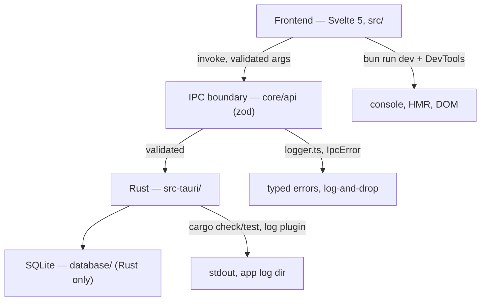

# Debugging DEX

## Purpose

This document is the debugging companion to the build and run guides. It maps
every layer of the stack — frontend (Svelte), IPC boundary (zod-validated
invoke), and Rust (`src-tauri/`) — to its debugging tools, explains how the
error envelope and the logging rules shape what you see, and lists the common
failure modes with their fixes. Read it when something does not work; the
[Verification (the gate)](#verification-the-gate) section at the end is the
gate for every change.

## The three layers and where failures surface

DEX is a Tauri 2 shell with a SvelteKit frontend and a Rust backend. A bug
lives in exactly one of three layers, and each layer has its own tools:



The first debugging question is always *which layer*: a failure that appears
in the shell but works in `bun run dev` is an IPC or Rust problem; a type
error is a frontend problem; a `pkg-config` failure is a Rust/toolchain
problem. The sections below are ordered by the layers they debug.

## Debugging the frontend

### `bun run check` — types first

The fastest frontend gate is the type checker:

```sh
bun run check
```

This runs `svelte-kit sync && svelte-check` against the strict
`tsconfig.json`. Type errors are reported with file and line; fix them before
anything else, because a type error often *is* the bug (wrong shape returned
from a contract client, a `null` where a value is required).

### `bun run dev` — iterate in a browser tab

```sh
bun run dev
```

Vite serves the SPA on port **1420** (`strictPort: true`; if the port is
busy, Vite refuses to start). In this mode the logger facade in
`src/lib/core/utils/logger.ts` detects it is not inside Tauri (`isTauri()` is
false) and falls back to the browser console, so frontend `logger` output
appears in DevTools.

What `bun run dev` exercises: layout, tokens, primitives, and theme switching.
What it does **not** exercise: Rust, IPC, plugins, or the window. A feature
that calls a contract client in `core/services/` fails in a browser tab,
because there is no Tauri runtime to answer `invoke`. Do not debug IPC in
this mode — debug IPC in the desktop window.

### Frontend console discipline

The frontend logs only through `core/utils/logger.ts` — never `console.*` in
new code. When you need to trace a frontend value:

1. Add `logger.debug(...)` at the point of interest (see
   [Logging](#logging-discipline) for levels).
2. Run `bun run tauri:dev` and read the output where the log plugin writes it
   (stdout and the app log directory).
3. Remove or gate the debug line before committing — debug logging is not
   shipping behavior.

## Debugging the IPC boundary

The IPC boundary is where a whole class of bugs is *caught*, not where it
lives: zod validates every invocation and every result (ADR-0002). When a
command misbehaves, the boundary tells you whether the failure is a shape
mismatch or a logic error.

### The error envelope

Rust `AppError` serializes manually to exactly `{ "type", "message" }`; `type`
is one of a closed set (`src-tauri/src/utils/errors.rs`). `core/api/tauri.ts`
validates every rejection against that set and normalizes both the structured
envelope and transport failures to `IpcError`. So in frontend code:

- A `validation` error means the input failed schema or semantic validation —
  the args were wrong, not the handler.
- A `not_found` / `conflict` / `permission_denied` / `unsupported` error means
  the Runtime applied a rule — inspect the message.
- An `internal` error (or a transport failure normalized to `IpcError`) means
  the Rust side failed — go debug Rust.

UI code handles typed errors, never `unknown`; if you catch a bare string or
`unknown`, that is itself a bug.

### Events: log-and-drop

Rust→UI events (`core/api/events.ts` `onEvent`) validate payloads against the
declared schema. An invalid payload is logged and dropped — it never reaches
your handler. If an event handler never fires, check the payload shape against
the `EVENTS` registry entry first; the drop is visible in the log output.

### The wire contract has two places

A command is callable only if it exists in both:

1. `src/lib/core/api/commands.ts` — the `defineCommand(...)` contract + schemas.
2. `src-tauri/src/lib.rs` — the fn appended to the **single**
   `generate_handler![...]`.

A command registered in only one place is not callable. The most insidious
variant: **two `invoke_handler` calls** in `lib.rs` — the second silently
shadows the first, so commands from the first call stop working with no error.
There must be exactly one.

## Debugging Rust

### `cargo check` and `cargo test`

```sh
cd src-tauri
cargo check
cargo test
```

`cargo check` is the fast gate: type and borrow errors surface here. `cargo
test` runs the Rust tests; the crate currently ships 56 unit tests (providers,
capability, migrations, errors) and they pass — run it after any Rust change.

### Undeclared Rust modules are not compiled

`src-tauri/src/` contains many 0-byte scaffolding files mirroring the PRD. A
file is compiled only if its module is declared with `mod` in its parent
`mod.rs` (or `lib.rs`). Do not add a `mod` for a 0-byte file — it fails to
compile. Only real, populated modules are declared today (`commands::core`,
`database::{connection, migrations}`, `providers/*`,
`utils::{errors, logger}`).

### Rust logging

The Rust side logs through the `log` crate; the `tauri-plugin-log` plugin
writes to stdout and the app log directory. When a command fails with
`internal`, the first place to look is that log output — the `AppError`
message is deliberately short, and the underlying cause is logged at the
source.

## Logging discipline

- The frontend imports `core/utils/logger.ts` only. No `console.*` in new
  code.
- The logger facade is a typed facade over `@tauri-apps/plugin-log`; levels
  are used as intended — `debug` for tracing, `info` for lifecycle, `error`
  for failures.
- In `bun run dev` the facade falls back to the browser console; in
  `bun run tauri:dev` it writes through the plugin. One import, both modes.
- Successful commands write nothing to stderr (CLI scripting contract), and
  debug tracing is removed or gated before commit.

## Common failures and fixes

| Symptom | Layer | Cause | Resolution |
|---|---|---|---|
| `bun run check` reports type errors | Frontend | Strict TS violation, often a wrong return shape from a contract client | Fix at the reported file/line; re-run `bun run check`. |
| Works in `bun run dev`, fails in the desktop window | IPC / Rust | No Tauri runtime in the browser tab, or a real IPC/Rust failure | Debug in `bun run tauri:dev`; check the log output for the rejection envelope. |
| Command "does nothing", no error | IPC | Registered in only one of `commands.ts` / `invoke_handler`, or a duplicate `invoke_handler` shadows the first | Check both sides of the wire contract; ensure exactly one `invoke_handler` in `lib.rs`. |
| Event handler never fires | IPC | Payload failed schema validation and was dropped | Compare the emitted payload with the `EVENTS` registry schema; the drop is logged. |
| `validation` error on a call you think is valid | IPC | Args failed zod schema — wrong field name, wrong type, unknown field | Validate against the `defineCommand` schemas in `core/api/commands.ts`; serde defaults (snake_case) are the wire authority. |
| `cargo check` fails with `pkg-config` error | Rust | Missing system library (`webkit2gtk-4.1`, `ayatana-appindicator3-0.1`) | Install the package from Build.md prerequisites; re-run `cargo check`. |
| Rust error about an undeclared module | Rust | `mod` points at a 0-byte scaffolding file | Remove the `mod`; do not declare 0-byte files. |
| Frontend logging is missing in the desktop window | Frontend | Code used `console.*` or imported the plugin directly | Route through `core/utils/logger.ts`. |
| CSP violations in the webview console (dev only) | Window | Strict CSP blocks Vite HMR in dev | Loosen the policy **only for the dev configuration** — never ship the loosened policy (ADR-0005). |
| Port 1420 busy | Tooling | `strictPort: true` in `vite.config.js` | Free the port; Vite will not silently pick another. |

## Verification (the gate)

Run `bun run verify` (`scripts/verify.ts`) from any cwd before merging. It runs nine gates in order, fail-fast:

1. `format:check` — frontend formatting (`prettier --check src/`)
2. `cargo:fmt:check` — backend formatting (`cargo fmt --check`, `--manifest-path`)
3. `lint` — frontend lint (`eslint src/`)
4. `check` — frontend types (`svelte-kit sync && svelte-check`)
5. `cargo:clippy` — backend lint (`clippy --all-targets --all-features -D warnings`)
6. `cargo:check` — backend types
7. `test` — frontend tests (`vitest run`)
8. `build` — frontend production build (`vite build`)
9. `cargo:test` — backend tests

CI runs exactly this gate on push/PR to `develop`/`main`. The individual `bun run check` and `bun run cargo:check` remain valid single-gate checks during development; `bun run tauri:dev` stays a manual desktop gate (transparent/compositor behavior cannot be tested headless, ADR-0004). A change failing any gate is not ready for review.

## Related Documents

- Build from source (prerequisites, common build failures):
  [`Build.md`](Build.md)
- Run locally (two run modes, window characteristics):
  [`RunLocally.md`](RunLocally.md)
- Performance budgets and measurement: [`Profiling.md`](Profiling.md)
- Repository map and wiring rules: [`ProjectStructure.md`](ProjectStructure.md)
- Typed IPC contract and error envelope: [`../50-adr/0002-typed-ipc-contract.md`](../50-adr/0002-typed-ipc-contract.md)
- Transparent compositing (desktop-only verification): [`../50-adr/0004-transparent-compositing.md`](../50-adr/0004-transparent-compositing.md)
- Plugin boundary and CSP: [`../50-adr/0005-plugin-boundary.md`](../50-adr/0005-plugin-boundary.md)
- System architecture (layers, wire contract): [`../20-architecture/20_System_Architecture.md`](../20-architecture/20_System_Architecture.md)
- Canonical terminology: [`../00-vision/03_Glossary.md`](../00-vision/03_Glossary.md)
