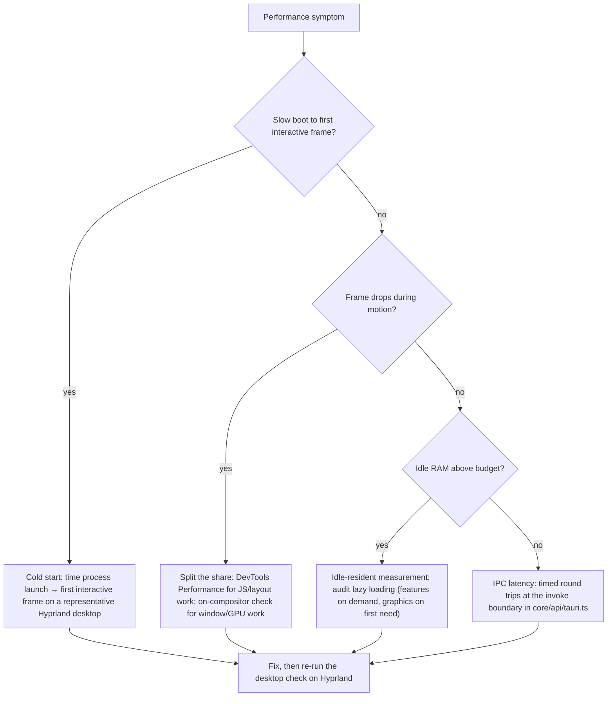

# Profiling DEX

## Purpose

This document is the performance-investigation guide: how to verify the
budgets, where the motion contract lives, and which instrument to reach for
when a budget is missed. The budgets themselves are owned by
[`../40-engineering/Performance.md`](../40-engineering/Performance.md) and by
the roadmap's success criteria; this document is the procedure, the tooling
status, and the decision tree for choosing an instrument.

DEX is a native layer over the operating system (Native First, Principle 5).
The shell is transparent and GPU-composited (ADR-0004), so a frame the
compositor cannot handle is a frame the user sees as lag. Measurement is a
contract, not an afterthought — but the tooling to measure systematically
lands with a named milestone (see [Tooling status](#tooling-status)).

## The performance contract

Three budgets and one motion contract, stated in full in
[`../40-engineering/Performance.md`](../40-engineering/Performance.md):

| Budget | Target |
|---|---|
| Cold start | < 500 ms from process launch to first interactive frame |
| Frame rate | 60 FPS sustained during shell motion |
| Idle RAM | < 200 MB resident with the shell idle and no features active |

The motion contract is a performance rule first:

- Animate **only `transform` and `opacity`**. Layout properties force reflow
  and repaint per frame; the compositor handles transform/opacity on the GPU.
- Durations **150–250 ms**, single easing
  `cubic-bezier(.22,.61,.36,1)`.
- `prefers-reduced-motion` disables non-essential motion entirely.
- **Blur is not animated.** `backdrop-filter` is a compositor cost on every
  repaint; blur radii stay within the token scale.

The compositing constraints are non-negotiable (ADR-0004): the window
background is transparent, the visual backdrop comes from glass panels over
translucent `--dex-surface-*` tokens, and no layer ever paints an opaque
window background. Every frame-rate check therefore happens on a Hyprland
session — never in a browser tab.

## Tooling status

No profiler tooling is configured in the repository yet. The roadmap
milestone **M0.4 (Development Tooling)** — ESLint, Prettier, Rustfmt, Clippy,
test runner, git hooks, CI skeleton — is shipped; the verification gate it
landed is the fixed gate for every change:

### Verification (the gate)

Run `bun run verify` (`scripts/verify.ts`) from any cwd before merging. It runs nine gates in order, fail-fast:

1. `format:check` — frontend formatting (`prettier --check src/`)
2. `cargo:fmt:check` — backend formatting (`cargo fmt --check`, `--manifest-path`)
3. `lint` — frontend lint (`eslint src/`)
4. `check` — frontend types (`svelte-kit sync && svelte-check`)
5. `cargo:clippy` — backend lint (`clippy --all-targets --all-features -D warnings`)
6. `cargo:check` — backend types
7. `test` — frontend tests (`vitest run`)
8. `build` — frontend production build (`vite build`)
9. `cargo:test` — backend tests

CI runs exactly this gate on push/PR to `develop`/`main`. The individual `bun run check` and `bun run cargo:check` remain valid single-gate checks during development; `bun run tauri:dev` stays a manual desktop gate (transparent/compositor behavior cannot be tested headless, ADR-0004). A change failing any gate is not ready for review.

Systematic measurement lands in two later milestones:

- **M2.4 (Performance, Phase 2)** — the graphics FPS monitor: object pooling,
  texture cache, and an FPS monitor that enforces the renderer's per-frame
  allocation discipline.
- **M9.1 (Performance, Phase 9)** — profiling, benchmarks, and memory tooling:
  the permanent, repository-wide measurement harness.

Until M9.1, the procedures below use tools that exist today (browser
DevTools, the shell's `perf`, `samply`, and manual instrumentation) so a
budget check is possible on the current tree.

## Choosing the instrument

The symptom determines the instrument. Start with the cheapest check that can
localize the failure.

## Procedure A — Cold start (< 500 ms)

The budget is a release-build criterion; the dev window is slower and is used
as a trend line.

1. Prepare a representative Hyprland desktop with no other load.
2. Launch the window and measure the time from process launch to the first
   interactive frame (first accepted input on the HUD).
3. Record the value and the machine it was measured on.

**Expected outcome:** in release builds the value stays under 500 ms on the
representative machine. In dev builds, watch the trend across changes rather
than the absolute value; a regression in the trend is a regression in the
budget. The permanent harness that automates this measurement lands with M9.1.

## Procedure B — Frame rate during motion (60 FPS)

1. Run `bun run tauri:dev` on the Hyprland session.
2. Trigger the shell's motion: panel transitions, dock hover, theme
   switching.
3. Verify sustained smoothness on the compositor. If your setup exposes a
   frame meter, use it; the repository's own FPS monitor lands with M2.4.

**Expected outcome:** no dropped frames during sustained motion. If frames
drop, split the work:

- **JS and layout share** — record the frontend slice in the browser DevTools
  Performance panel under `bun run dev`. Long tasks, layout thrash, and
  per-frame allocation show up there.
- **Window and GPU share** — the DevTools panel cannot see compositor work.
  Check the animation against the motion contract (transform/opacity only,
  token durations), then check `backdrop-filter` cost and the graphics
  render-loop (Procedure E).

## Procedure C — Rust core profiling

The Rust side owns command handlers, SQLite, and system access. The intended
workflow — the tooling that makes it routine lands with M9.1 — uses native
profilers:

1. Reproduce the slow path with `bun run tauri:dev`.
2. Attach `perf` to the Rust process (`perf record -p <pid>`) or launch the
   process under `samply record`, which opens the results in the Firefox
   Profiler UI.
3. Focus on the command handlers (`src-tauri/src/commands/`), the services
   behind them, and SQLite queries.

**Expected outcome:** a flamegraph showing where the Rust side spends time.
Optimize the hot path, then re-run `cargo check` and the desktop check.

## Procedure D — IPC latency

Every round trip crosses five stages: args zod-parse → IPC → serde
deserialize → Rust handler → serde serialize → result zod-parse
(ADR-0002). The single choke point is `invoke` in
`src/lib/core/api/tauri.ts`.

1. Measure around a contract-client call in `src/lib/core/services/` using
   the logger facade (`logDebug`) or `performance.now()` deltas — dev-only,
   removed from the shipped path.
2. Compare a hot command against a cold one. Watch for per-call schema
   construction: schemas are module-level singletons built once by
   `defineCommand` (`src/lib/core/api/commands.ts`); a schema constructed per
   call is an allocation bug (Performance.md).

**Expected outcome:** the timing isolates boundary cost from handler cost. A
latency regression is either a schema problem (zod parse cost) or a Rust
handler problem (work done per call).

## Procedure E — Render-loop checks

The graphics layer owns exactly one frame loop (`requestAnimationFrame`,
driven by the renderer; `src/lib/graphics/README.md`). Nothing outside
`graphics/` schedules frames, and the loop starts lazily on first visual need.

1. Add a dev-only frame-delta log in the loop; at 60 FPS a frame completes in
   about 16.6 ms.
2. Check for per-frame allocations — steady state must be zero per the
   graphics performance contract.

**Expected outcome:** long frames correlate with UI work or GPU work performed
inside the loop. The fix is to move that work out of the loop, not to skip the
frame. The FPS monitor that makes this a standing check lands with M2.4.

## Performance review gates

Any change that touches the shell surface, motion, or IPC passes the ordered
gates from Performance.md before it is ready for review:

1. Review: transform/opacity only, token motion values.
2. Review: no per-call schema construction, no hot-path allocation.
3. Review: lazy-loaded where appropriate, no boot-time heavy work.
4. Manual: 60 FPS sustained on Hyprland.

## Related Documents

- Performance standards and budgets:
  [`../40-engineering/Performance.md`](../40-engineering/Performance.md)
- Debugging the frontend, Rust, and IPC: [`Debug.md`](Debug.md)
- Build from source: [`Build.md`](Build.md)
- Repository map and wiring rules: [`ProjectStructure.md`](ProjectStructure.md)
- Design system (motion values, tokens):
  [`../40-engineering/DesignSystem.md`](../40-engineering/DesignSystem.md)
- Transparent compositing: [`../50-adr/0004-transparent-compositing.md`](../50-adr/0004-transparent-compositing.md)
- Design tokens (motion contract): [`../50-adr/0003-design-tokens.md`](../50-adr/0003-design-tokens.md)
- Graphics subsystem: [`../20-architecture/25_Graphics.md`](../20-architecture/25_Graphics.md)
- Roadmap (M0.4, M2.4, M9.1): [`../10-product/11_Product_Roadmap.md`](../10-product/11_Product_Roadmap.md)
- Canonical terminology: [`../00-vision/03_Glossary.md`](../00-vision/03_Glossary.md)
