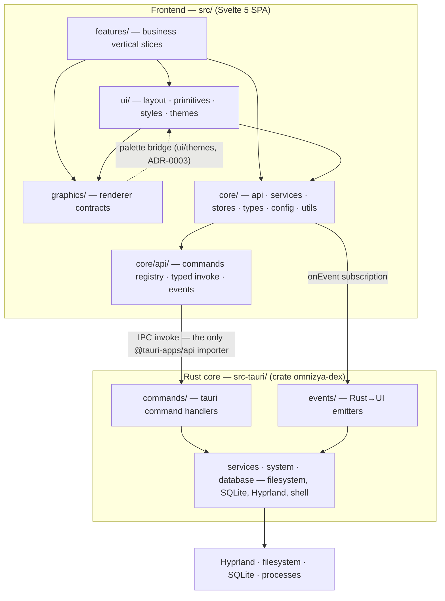

# Project Structure

## Purpose

This document is the map of the DEX repository: what each top-level directory
is for, the rules that keep the dependency graph acyclic, and where a new
feature is wired in. Read [ADR-0001] and [ADR-0002] before touching
cross-cutting code; AGENTS.md remains the operational ground truth for
commands and repo mechanics.

DEX is two codebases that meet at the IPC boundary:

- `src/` — the SvelteKit 2 (Svelte 5 runes) SPA. `adapter-static` with an
  `index.html` fallback and `ssr = false` (`src/routes/+layout.ts`); there is
  no Node server.
- `src-tauri/` — the Rust crate `omnizya-dex` (library target
  `omnizya_dex_lib`). It owns every system access: filesystem, SQLite,
  Hyprland, processes.

The dependency direction is one-way and acyclic — each layer may depend only
on the layers below it, never on the layers above (ADR-0001).

## Top-level layout

```
assets/          — creative assets: fonts, icons, images, models, shaders,
                   sounds, wallpapers (empty until their owners land)
database/        — append-only SQL migrations, seeds, and the local dex.db
docs/            — the ten-section documentation tree (see below)
plugins/         — extension manifests for future Plugins (empty)
scripts/         — automation scripts: build, clean, migrate, release, seed
                   (empty scaffolding; land with M0.4)
src/             — the Svelte frontend
src-tauri/       — the Rust crate
static/          — static web assets served by the SPA (favicon, manifest)
tests/           — unit, integration, e2e, backend, frontend suites
                   (empty scaffolding; land with M0.4)
.github/         — CI workflows and the PR template (empty; M0.4)
```

## src/ — the frontend

```
src/
├── routes/            — SvelteKit SPA routes
│   ├── +layout.ts     — ssr = false (the SPA contract)
│   ├── +layout.svelte — imports app.css, bootstraps the theme store
│   └── +page.svelte   — renders the HUD (src/lib/ui/layout/)
├── lib/
│   ├── features/      — business vertical slices (feature-first)
│   ├── core/          — shared infrastructure
│   ├── ui/            — reusable visuals
│   ├── graphics/      — engine-agnostic renderer contracts
│   └── types/         — cross-cutting shared types
```

### features/

`features/<feature>/{components,services,stores,types,utils}` — business
logic only, one folder per product feature (Principle 10). Each feature owns
its components, its services (which compose contract clients and feature
state), its rune stores, types, and utilities.

**Rule (ADR-0001):** features never import other features. Shared logic moves
to `core/` or `ui/`; a cross-feature import couples two vertical slices and
breaks the acyclic graph.

### core/

Shared infrastructure — product-independent, imported by features and `ui/`,
never importing them.

- `api/` — the IPC contract layer (ADR-0002): `commands.ts` registry
  (rejects duplicate names), `tauri.ts` zod-validated invoke + the closed
  error-code envelope, `events.ts` typed listen + the `EVENTS` registry.
  **`core/api` is the only place `@tauri-apps/api` may be imported.**
- `services/` — one typed contract client per command domain, mirroring
  `src-tauri/src/commands/`. Features reach Rust exclusively through these
  clients.
- `stores/` — rune stores (`.svelte.ts` files); `theme.svelte.ts` is the
  reference pattern.
- `types/` — shared domain types.
- `config/` — app constants, layout and theme defaults.
- `utils/` — the logger facade (`logger.ts`, the only logging import the
  frontend may use) and `storage.ts` (persistence).

### ui/

Reusable visuals, consumed by features.

- `layout/` — the shell surface: `HUD.svelte`, `TopBar.svelte`,
  `Dock.svelte`, `StatusBar.svelte`.
- `primitives/` — `GlassPanel`, `Button`, `Icon`, `Tooltip`, `Divider`, and
  the rest of the primitive set.
- `styles/` — `tokens.css` (primitive → semantic token layers), plus effects
  and utilities. Components consume `--dex-*` tokens only, never hardcoded
  values.
- `themes/` — TS palettes (`dark`, `light`, `cyber`) mirroring the CSS for
  programmatic and GPU use (ADR-0003).

### graphics/

Engine-agnostic rendering contracts (`contracts.ts`): the `Renderer` and
`RenderSurface` interfaces, the transparency rule (ADR-0004), and the
frame-loop ownership. Nothing outside `graphics/` touches WebGL or `three`.
Phase 0 ships only the contracts; implementations arrive with the first GPU
feature (Phase 2).

### routes/

The SPA pages. `+page.svelte` renders the HUD; `dashboard`, `plugins`,
`settings`, and `terminal` routes exist as feature entry points.

## src-tauri/ — the Rust crate

```
src-tauri/
├── src/
│   ├── main.rs        — calls omnizya_dex_lib::run()
│   ├── lib.rs         — the Tauri builder: plugins, the single
│   │                    generate_handler!, capabilities
│   ├── commands/      — #[tauri::command] handlers, one module per domain
│   ├── events/        — Rust→UI emitters (names declared in the EVENTS registry)
│   ├── services/      — native services behind the commands
│   ├── system/        — system probes (cpu, memory, disk, network, …)
│   ├── database/      — SQLite connection, migrations, queries
│   ├── models/        — Rust models mirroring the schema
│   ├── state/         — shared app state
│   ├── plugins/       — Plugin loading and manifests (ADR-0005)
│   ├── ai/            — AI providers (Phase 6)
│   ├── ipc/           — IPC protocol helpers
│   ├── config/        — app configuration
│   └── utils/         — errors.rs (AppError) and module wiring
├── capabilities/
│   └── default.json   — ACL grants for the main window
├── tauri.conf.json    — window config, CSP, build/dev wiring
└── Cargo.toml         — crate `omnizya-dex`, lib `omnizya_dex_lib`
```

Commands take exactly one serde struct arg and return `Result<T, AppError>`
(`src-tauri/src/utils/errors.rs`); the hand-written `Serialize` impl emits
the `{type, message}` envelope and must never be replaced with a derived one
(ADR-0002). Every command is registered in the **single** `invoke_handler` in
`lib.rs` — a second call silently shadows the first.

## docs/ — the ten-section documentation tree

| Section | Purpose |
|---|---|
| `00-vision/` | Identity and scope: manifesto, vision, the twelve principles, glossary, non-goals |
| `10-product/` | Product spec: master PRD, roadmap, personas, user stories, feature matrix, Workspace Runtime, user flows, UX principles |
| `20-architecture/` | System architecture and subsystem designs: frontend, backend, database, event bus, graphics, AI, plugins, search, security |
| `30-specs/` | Formal contracts: Workspace, Manifest, Snapshot, Knowledge, PluginAPI, WidgetAPI, Theme, and the rest |
| `40-engineering/` | Engineering standards and workflow: coding standards, design system, git workflow, performance, testing, CI, accessibility, release |
| `50-adr/` | Architecture decision records, numbered and dated |
| `60-rfc/` | Requests for comment — proposals under discussion |
| `70-api/` | Public API reference: CLI, commands, events, plugins and widgets |
| `80-guides/` | How-to guides: creating a Workspace, Plugin, Widget, Theme; using AI |
| `90-dev/` | Developer guides for this repository: build, run, debug, profile, structure |

## database/ — append-only migrations

`database/migrations/` holds zero-padded SQL migrations (`001_init.sql`
through `005_history.sql`). Migrations are **append-only** (ADR-0001): a
committed migration is never edited; every schema change is a new migration
plus a Rust model plus a zod schema in one slice. `database/seeds/default.sql`
seeds local state; `database/dex.db` is the local database file.

## tests/, scripts/, .github/

All three are empty scaffolding today. The roadmap milestone **M0.4
(Development Tooling)** lands the test runner, linting, formatting, git
hooks, and the CI skeleton; the empty files exist so the layout is fixed in
advance. Nothing in these trees is imported or executed yet.

## Layer ownership



Solid arrows mean "depends on": features depend on `ui`, `core`, and
`graphics`; `ui` depends on `core` and consumes the `graphics` contracts;
`core/api` is the only importer of `@tauri-apps/api`; the Rust layers own all
system access. The single dashed edge is the palette bridge: `graphics` reads
scene colors from `ui/themes/*.ts` and never imports business logic.

## Wiring a new command — the ADR-0002 five-step checklist

1. **Rust:** `src-tauri/src/commands/<domain>.rs` — `#[tauri::command]`,
   `Result<T, AppError>`, exactly one serde struct arg, no
   `#[serde(rename_all = ...)]` (snake_case serde defaults are the wire
   authority).
2. **Rust:** declare the module and append the fn to the single
   `generate_handler![...]` in `src-tauri/src/lib.rs`. Exactly one
   `invoke_handler` call may exist; a second silently shadows the first.
3. **TS:** add a `defineCommand(...)` contract with schemas to
   `src/lib/core/api/commands.ts` (duplicate names are rejected). Infallible
   commands use `z.null()`.
4. **TS:** expose a typed async function in
   `src/lib/core/services/<domain>.ts` that returns the domain's typed result
   and surfaces `IpcError` on failure.
5. **Capability:** grant any plugin surface the command needs in
   `src-tauri/capabilities/default.json` (`log:default` and `opener:default`
   are already granted).

The wire contract for a command lives in exactly two places — the registry in
`core/api/commands.ts` and the handler list in `src-tauri/src/lib.rs`. A
command not in both is not callable.

## Wiring an event — Rust → UI

Emit from `src-tauri/src/events/`, declare the name in the `EVENTS` registry
(`dex.<domain>.<event>` naming) in `src/lib/core/api/events.ts`, and subscribe
with `onEvent(name, schema, handler)`. Payloads that fail the schema are
logged and dropped, never thrown into the handler (ADR-0002).

## Current state of the tree

Phase 0 (M0.1–M0.3) is done; business features are not built yet. The
populated surface today is:

- `core/api/` fully populated; `core/services/` currently ships one contract
  client (`greet.ts`); `core/stores/` ships the theme store plus shell and
  notification stores; `core/utils/` ships `logger.ts` and `storage.ts`.
- `src-tauri/` ships `commands::core` (the `greet` command) and
  `utils::errors` (`AppError`); `lib.rs` wires the `opener` and `log` plugins.
- Most of `features/**`, the remaining `core/**` modules, and the rest of
  `src-tauri/**` are empty scaffolding that lands with its owning milestone.
  Undeclared Rust modules are not compiled — do not `mod` an empty file.
- `database/`, `tests/`, `scripts/`, `.github/` are empty as described above.

Do not assume an empty file works or import it. A command is only callable
once it exists in both contract files; a Rust module is only compiled once
its `mod` declaration exists.

## Related Documents

- Build from source: [`Build.md`](Build.md)
- Run the two run modes: [`RunLocally.md`](RunLocally.md)
- Debugging the frontend, Rust, and IPC: [`Debug.md`](Debug.md)
- Performance budgets and measurement: [`Profiling.md`](Profiling.md)
- Layer model and folder ownership:
  [`../50-adr/0001-layer-ownership.md`](../50-adr/0001-layer-ownership.md)
- Typed IPC contract: [`../50-adr/0002-typed-ipc-contract.md`](../50-adr/0002-typed-ipc-contract.md)
- Design tokens: [`../50-adr/0003-design-tokens.md`](../50-adr/0003-design-tokens.md)
- Plugin boundary (capabilities): [`../50-adr/0005-plugin-boundary.md`](../50-adr/0005-plugin-boundary.md)
- Coding standards: [`../40-engineering/CodingStandards.md`](../40-engineering/CodingStandards.md)
- System architecture: [`../20-architecture/20_System_Architecture.md`](../20-architecture/20_System_Architecture.md)
- Feature-first architecture (Principle 10):
  [`../00-vision/02_Principles.md`](../00-vision/02_Principles.md)
- Canonical terminology: [`../00-vision/03_Glossary.md`](../00-vision/03_Glossary.md)
